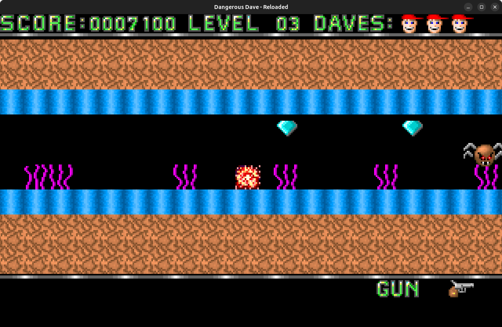
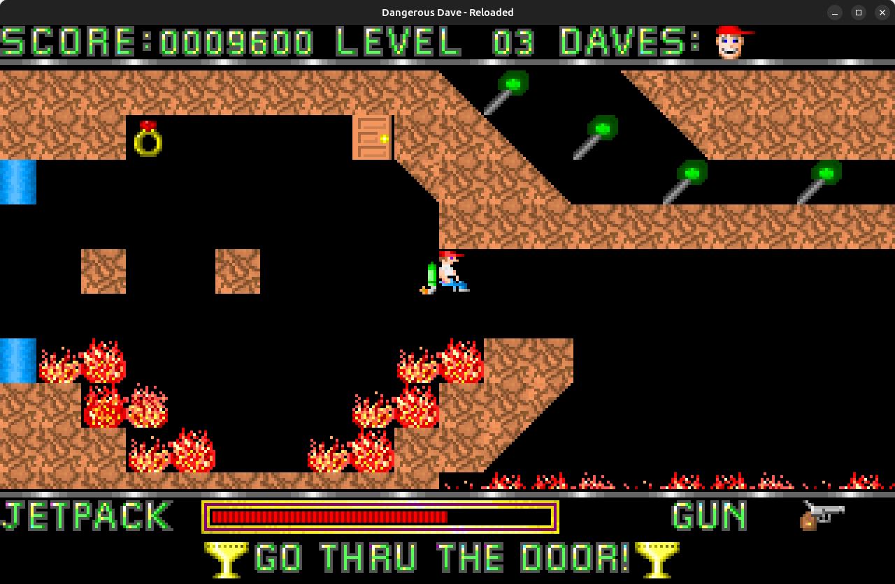

High school thesis project.

This project was intended to be a close replica of the old game Dangerous Dave,
which was one of the first PC games I've played.
The goal was to avoid the use of a game engine, in order to increase
the challenge and involve a more intensive Java coding.

The levels are loaded from the file "gamedata.dat", that is created
using the DDR - Level Editor program (https://github.com/steurendo/DDR-LevelEditor).

Commands:
- Move: arrows
- Jetpack: <kbd>Shift</kbd>
- entities.Shoot: <kbd>Ctrl</kbd>

 
 

