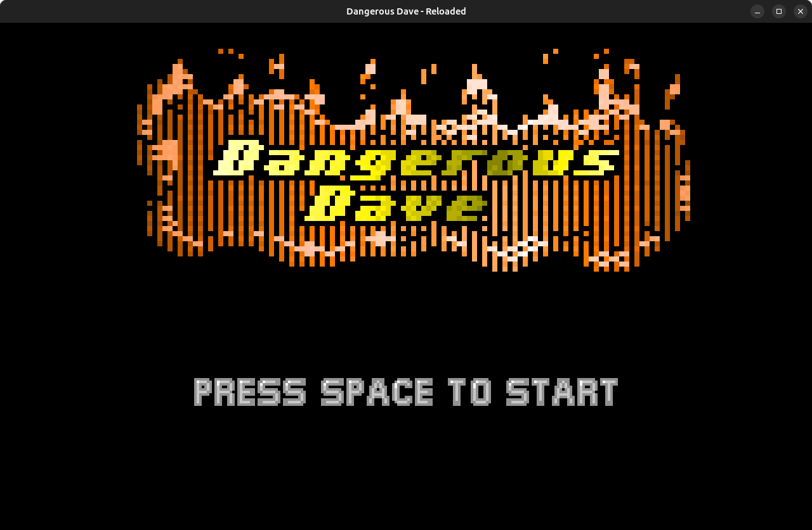
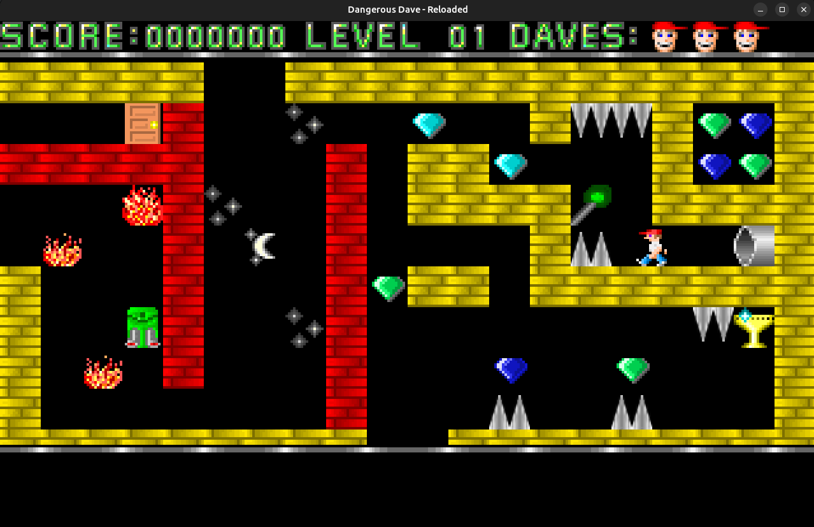

High school thesis project.

This project was intended to be a close replica of the old game Dangerous Dave,
which was one of the first PC games I've played.
The goal was to avoid the use of a game engine, in order to increase
the challenge and involve a more intensive Java coding.

While I'm keeping the original code I wrote at the time in a dedicated branch,
I'm currently maintaining the project in my free time: I plan to implement the
missing parts (e.g., level-level transition, score menu, etc...), to improve
the code structure and to gradually fix bugs.

Despite the intention was just to build a mirror-like replica, at the time
I did add some new tiles (and a try of the freaking "Level 6 Warpzone"),
and eventually I could decide to add some more stuff.

The levels are loaded from the file "gamedata.dat"; the levels structure can be
customized using the <a href="https://github.com/steurendo/DDR-LevelEditor">DDR - Level Editor</a> program.

Commands:
- Move: arrows
- Jetpack: <kbd>Shift</kbd>
- entities.Shoot: <kbd>Ctrl</kbd>

 
 